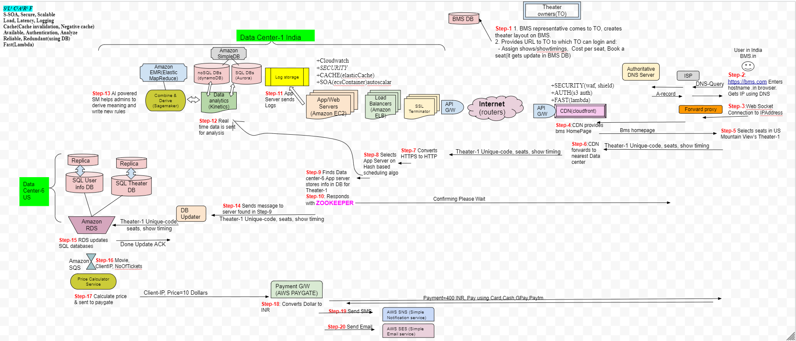

# BookMyShow.com / TicketMaster.com / Online Ticket Booking system

| Mega/Million 10<sup>6</sup> | Giga/Billion 10<sup>9</sup> | Tera/Trillion 10<sup>12</sup> | Peta/Quadrillion 10<sup>15</sup> | Exa/Quintillion 10<sup>18</sup> | Zeta/Sextillion 10<sup>21</sup> |
| --- | --- | --- | --- | --- | --- |

# To Cover
- *1.* Requirements (functional, non-functional)
- *2.* Back of Envelope Calculations
  - Traffic Estimates
  - Storage Estimates
- *3.* HLD(High level Design)
  - 1 user
  - 100 users >>> 1 lac users
- *4.* Database schema
- *5.* S<sup>3</sup> L<sup>3</sup> C<sup>2</sup> A<sup>3</sup> R<sup>2</sup> F
  - Scalable, Secure, SOA
  - Logging, Load, Latency
  - Cache(Invalidation, negative cache)
  - Available, Accurate, Analyze, Authenticate
  - Reliable, Redundant(Using DB)
  - Fast

# 1. Requirements
> When user logs into portal.. Portal should..
- *1.* Show Movies in City. 
  - *a.* Option to select Country > State > City > Show Movies in City
  - *b.* Ask permission from user to detect location
- *2.* Show Theater names, showtimings after Clicking on Movie name.
```c
Movie: Rambo
PVR-Select-Delhi  1:41pm  4:45pm  8pm
PVR-Naraina-Delhi 2pm   5pm   9pm
..
```
- *3.* Show seat layout to user to select seats. Seat can be holded for 5 minutes.
- *4.* After seat selection, take payment.
- *5.* Send E-Ticket on Phone, Email.

# 2. BOE Calculations
## *2a.* Traffic Estimates/Connections to be served/second.

|World Population|Using internet|Booking ticket on bookmyshow/month|PerDay|PerSecond|
|---|---|---|---|---|
|7 x 10<sup>9</sup>|40%|1% = 28 x 10<sup>6</sup>|9 x 10<sup>5</sup>|10<sup>4</sup> / 16 = 625|

## *2b.* Storage Estimates/Bytes to be stored for 5 years
- **Theater Data** Every theater information(name,address,number of seats) are stored inside bookmyshow.com's DB.
  - Theater will be base class. All derived classes are objects of theater base class.
  - All derived classes are created at start of Application(ie nothing created at runtime).
```c++
  class Theater {                         //Total size = 15+15+100+5700 = around 6000 bytes
    string TheaterName;                       //Max=30 characters. 1 character=4bit(Hex no system). 30 characters = 120bit = 15 byte
    string TheaterState;                      //15 byte
    string TheaterAddress(including PIN);     //200 characters. 800 bits. 100 bytes
    bool seats [row][col];                    //Each theater will have different. Assumed row=15, col=10
    struct userInformation[row][col];         //Each seat will have associated user DataStructure.  150x38 = 5700 bytes
  };
  struct userInformation{                   //38 bytes
    string name;                            //Max 30 characters. 15 bytes
    string email;                           //Max 30 characters. 15 bytes
    uint64_t phoneNumber;                   //64 bit. 8 byte
  };
  
-> For all 3600 Theaters. 5700x3600 = 20 MB
```

||Theater+User Data|Photos|Blogs|Videos|
|---|---|---|---|---|
|PerDay|20 MB|<ul><li>1 photo=5KB</li></ul>1 lac photos anytime. 5x10<sup>9</sup></li></ul>|<ul><li>1 blog=100KB</li></ul>1 lac blogs anytime. 100x10<sup>9</sup></li></ul>|<ul><li>1 Video=1GB</li></ul>50K videos anytime. 5x10<sup>13</sup></li></ul>|
|5 years|20 MB|5x10<sup>9</sup>|100x10<sup>9</sup>|5x10<sup>13</sup>|

- {For 5 years} 20 MB + 5x10<sup>9</sup> + 100x10<sup>9</sup> + 5x10<sup>13</sup> = 6 x 10<sup>13</sup> = 60 Tera Bytes / 5 years
- At anytime website will have 1 lac photos, blogs, 50k movies. Old will be deleted and new will be added.

# 3. HLD 
## A. 1 User
```
          Server
Stores all seats,theater listing
of worldwide theaters                               User
            <--Logs into server, does seat booking--
                                              Prints seatno, date
```

## B. 100-1Million Users
### 4. Application Server(Amazon EC2):
- Finds which server stores info in DB for Theater-1
- **Other Components**
  - **Amazon SimpleDB** Nosql databases master-slave pairs are made highly available using this.
  - **Amazon EMR(Elastic MapReduce)** Processes vast amounts of data using open source tools(as: Apache Spark, Apache Hive, Apache HBase, Apache Flink, Apache Hudi, and Presto). 
  - **Amazon Cloudwatch** Monitors health/logs/statistics of Application server using cloudwatch
### 5. DB Updater Service
- Updates user information in SQL databases. 
- **Other components**
  - **Amazon RDS** All SQL databases are connected using Amazon RDS(Relational DB Service).


